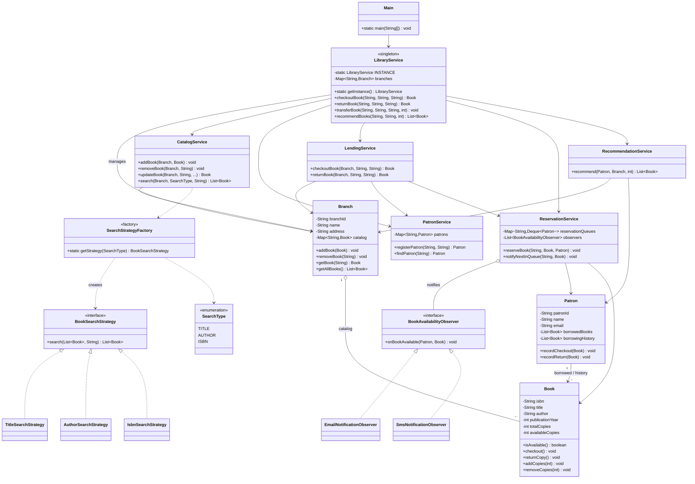

# Library Management System — Low-Level Design

A console-based Library Management System built in Core Java for the
Airtribe Backend Java Track (Module 9 LLD assignment). It models
librarians managing books, patrons, and lending across multiple
branches, entirely in-memory (no database, no persistence, no external
APIs — the brief deliberately scopes this to OOP + design patterns).

## Features

**Core**
- **Book Management** — add, remove, update books; search by title,
  author, or ISBN
- **Patron Management** — register patrons, track each patron's
  currently-borrowed books and full borrowing history
- **Lending** — checkout and return, with clear errors when a book
  doesn't exist or has no available copies
- **Inventory** — every `Book` tracks total vs. available copies per
  branch

**Optional extensions**
- **Multi-branch support** — books live per-branch; copies can be
  transferred between branches
- **Reservation system** — patrons can reserve a book that's fully
  checked out; the next patron in the queue is notified (via Observer)
  the moment a copy is returned
- **Recommendations** — suggests other books by a patron's most-borrowed
  author, based on their borrowing history

See [`docs/Design_Notes.md`](docs/Design_Notes.md) for the assumptions,
the reasoning behind the package layout, and how each design pattern and
SOLID principle is applied.

## Design Patterns Used

| Pattern   | Where                                              | Why |
|-----------|-----------------------------------------------------|-----|
| Strategy  | `strategy` package (`BookSearchStrategy` + impls)  | Swap search-by-title/author/ISBN logic without branching in `CatalogService` |
| Factory   | `factory.SearchStrategyFactory`                    | Single place that maps a `SearchType` to its strategy |
| Observer  | `observer` package + `ReservationService`          | Notify any number of channels (email, SMS, ...) when a reserved book becomes available |
| Singleton | `service.LibraryService`                           | One shared view of branches, patrons, and reservations across the app |

## Package Structure

```
com.airtribe.librarysystem
├── model      Book, Patron, Branch
├── exception  BookNotFoundException, BookNotAvailableException,
│              PatronNotFoundException, BranchNotFoundException
├── strategy   BookSearchStrategy, TitleSearchStrategy,
│              AuthorSearchStrategy, IsbnSearchStrategy, SearchType
├── factory    SearchStrategyFactory
├── observer   BookAvailabilityObserver, EmailNotificationObserver,
│              SmsNotificationObserver
├── service    CatalogService, PatronService, LendingService,
│              ReservationService, RecommendationService, LibraryService
├── util       IdGenerator
└── ui         Main (scripted demo of every flow)
```

## Class Diagram



## How to Compile and Run

Requires a JDK (17 recommended). All source lives under
`src/main/java`, rooted at the `com.airtribe.librarysystem` package.

### From the terminal

From the project root:

```bash
# Compile
javac -d out $(find src/main/java -name "*.java")

# On Windows PowerShell, use instead:
# Get-ChildItem -Recurse -Filter *.java src/main/java | ForEach-Object { $_.FullName } | Out-File sources.txt -Encoding ascii
# javac -d out "@sources.txt"

# Run
java -cp out com.airtribe.librarysystem.ui.Main
```

### From an IDE (IntelliJ IDEA / Eclipse / VS Code)

1. Open the project root folder as a new project.
2. Mark `src/main/java` as a **Sources Root** (IntelliJ) or ensure it's
   on the build path (Eclipse/VS Code).
3. Run `com.airtribe.librarysystem.ui.Main`.

## Sample Output

Running `Main` walks through: adding books to two branches, searching by
title, a normal checkout, a second patron being turned away and
reserving the book instead, the first patron returning it (which fires
an email + SMS notification to the waiting patron via the Observer
pattern), a multi-branch transfer of copies, and finally a
recommendation based on the patron's borrowing history.
